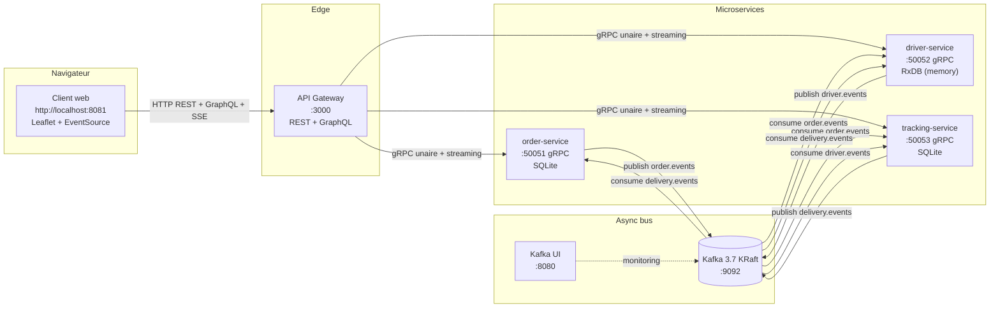

SoA Livraison
=============

Mini-projet du cours **SoA et Microservices** (M. Gontara, AU 2025-2026).

Une appli de livraison à la Uber Eats simplifiée. Un client passe une commande, le système attribue automatiquement un livreur disponible, le livreur récupère puis livre, et la position GPS est suivie en temps réel sur une carte côté client. Tout tourne en local via Docker Compose.

> Le sujet officiel du cours est dans `Cahier de charges - Microservices.docx`.


Sommaire
--------

1. [Architecture](#architecture)
2. [Stack technique](#stack-technique)
3. [Comment lancer](#comment-lancer)
4. [Les interfaces de la démo](#les-interfaces-de-la-démo)
5. [Workflow type](#workflow-type)
6. [Structure du repo](#structure-du-repo)
7. [Postman](#postman)
8. [Notes de conception](#notes-de-conception)


Architecture
------------

7 conteneurs Docker, 3 microservices métier + 1 broker Kafka + 1 dashboard Kafka + 1 API Gateway double protocole (REST/GraphQL) + 1 client web.



**Topics Kafka et qui consomme quoi :**

| Topic | Producer | Consumers |
|---|---|---|
| `order.events` | order-service | driver-service, tracking-service |
| `driver.events` | driver-service | tracking-service |
| `delivery.events` | tracking-service | order-service, driver-service |

Personne ne s'appelle directement entre services : tout est asynchrone via Kafka. Le gateway est le seul point de contact synchrone, en gRPC vers les 3 services.


Stack technique
---------------

| Couche | Choix |
|---|---|
| Runtime | Node.js 24 (`node:24-alpine` partout) |
| RPC inter-services | gRPC via `@grpc/grpc-js` + `@grpc/proto-loader` |
| Streaming | gRPC server-streaming (positions + watch delivery) |
| Async messaging | Apache Kafka 3.7 en mode KRaft (sans Zookeeper), `kafkajs` côté Node |
| Persistance order/tracking | SQLite via `node:sqlite` (built-in, flag `--experimental-sqlite`) |
| Persistance driver | RxDB en mémoire (`getRxStorageMemory`) avec observables réactifs |
| API Gateway | Express 4 + Apollo Server 4 (REST + GraphQL sur le même port) |
| Front | HTML/CSS vanille + Leaflet + EventSource pour SSE |
| Orchestration | Docker Compose (7 conteneurs) |
| Tests | Clients de test gRPC en Node + collections Postman |


Comment lancer
--------------

Prérequis : **Docker Desktop** et **Node.js 24** (uniquement si tu veux lancer les `test-client.js` en dehors des conteneurs).

```bash
# Cloner le repo
git clone <url-du-repo>
cd soa

# Tout démarrer (build + run en arrière-plan)
docker compose up -d

# Vérifier que tout tourne (7 conteneurs)
docker compose ps
```

**URLs disponibles après `docker compose up -d` :**

| URL | Quoi |
|---|---|
| http://localhost:8081 | Client web — interface principale (REST par défaut) |
| http://localhost:8081/graphql.html | Même interface, version 100% GraphQL |
| http://localhost:3000/health | Health-check du gateway |
| http://localhost:3000/api/* | Endpoints REST du gateway |
| http://localhost:3000/graphql | Endpoint GraphQL + Apollo Sandbox interactif (en GET) |
| http://localhost:8080 | Kafka UI — voir les topics, messages, consumer groups |

**Pour arrêter et tout nettoyer (utile pour repartir d'une base vide) :**

```bash
docker compose down -v   # -v supprime les volumes (Kafka, SQLite)
```


Les interfaces de la démo
--------------------------

Le client web (`http://localhost:8081`) propose **3 rôles** dans une nav unique :

### 👤 Client
- Formulaire simplifié pour passer une commande (nom + items, l'adresse est hardcodée)
- Liste persistante de mes commandes (via un `customer_id` stocké en localStorage)
- Suivi en live : timeline de statut + mini-carte avec position du livreur qui se déplace
- Bouton "Annuler ma commande" tant qu'elle n'est pas DELIVERED

### ⚙️ Admin
- **Sous-onglet Livreurs** : ajouter un livreur, voir la liste avec status (AVAILABLE / BUSY), bouton Supprimer (refusé si BUSY)
- **Sous-onglet Commandes** : tableau filtrable de toutes les commandes, bouton Annuler (si en cours) ou Supprimer (si terminée)
- Click sur un livreur BUSY ouvre directement l'onglet Livreur préchargé avec sa commande

### 🛵 Livreur
- Sélectionne un livreur dans la dropdown
- Voit sa commande en cours (client, adresse, statut)
- **Bloc "Simulation déplacement"** : 2 boutons orange "Aller récupérer" / "Aller livrer" qui animent la position GPS sur 4 sec (16 frames)
- **Bloc "Changer le statut"** : 3 boutons "J'ai récupéré / En route / Livré" qui font avancer le statut via Kafka

**Toggle REST/GraphQL** dans la topbar pour basculer entre les 2 versions de l'interface (mêmes fonctionnalités, protocoles différents).


Workflow type
-------------

Démo end-to-end depuis une base vide :

1. **Admin → Ajouter "Karim" (scooter)**
   → driver créé, status AVAILABLE

2. **Client → Passer commande "Pizza Neptune"**
   → order créée, status PENDING
   → après ~2s : timeline avance à ASSIGNED, "Livreur : Karim", la carte affiche Karim

3. **Admin → Click sur la ligne BUSY de Karim**
   → bascule auto vers l'onglet Livreur préchargé

4. **Livreur → "Aller récupérer la commande"**
   → 4 sec d'animation, le marker glisse vers le restaurant
   → côté Client la carte se met à jour en live (SSE)

5. **Livreur → "J'ai récupéré"**
   → côté Client, timeline avance à PICKED_UP

6. **Livreur → "Aller livrer"**
   → 4 sec d'animation vers l'adresse client

7. **Livreur → "Je suis en route"**
   → IN_TRANSIT côté Client

8. **Livreur → "C'est livré"**
   → DELIVERED côté Client
   → Karim repasse AVAILABLE dans Admin (libération automatique via Kafka)

**Variantes intéressantes à tester :**
- Créer plusieurs commandes sans driver → elles s'accumulent dans la file d'attente in-memory de driver-service. Ajouter un driver les vide une par une (FIFO).
- Annuler une commande en cours → cascade `order.cancelled` → tracking met la delivery en CANCELLED → driver-service libère le livreur → si une autre commande attend, il la prend immédiatement.
- Tester la version GraphQL : workflow identique mais 100% via queries/mutations (la timeline utilise du polling 1.5s au lieu du SSE).


Structure du repo
-----------------

```
soa/
├── proto/                    # Contrats gRPC partagés (3 .proto, mountés dans chaque conteneur)
│   ├── order.proto
│   ├── driver.proto
│   └── tracking.proto
├── services/
│   ├── order-service/        # Port 50051, SQLite
│   ├── driver-service/       # Port 50052, RxDB memory + queue FIFO d'orders
│   └── tracking-service/     # Port 50053, SQLite + EventEmitter pour streaming
├── gateway/                  # Port 3000, Express + Apollo Server
│   └── src/
│       ├── grpc-clients.js   # Wrap promisifié des 3 clients gRPC
│       ├── rest/             # Routes REST par ressource (orders/drivers/deliveries)
│       └── graphql/          # Schema + resolvers avec joins cross-services
├── client/                   # Port 8081, statique servie par mini Express
│   └── public/
│       ├── index.html        # Page principale (REST)
│       ├── graphql.html      # Jumelle GraphQL
│       ├── styles.css        # Design system
│       ├── app.js            # Logique REST
│       └── graphql-app.js    # Logique GraphQL (polling)
├── docs/postman/             # Documentation et collections Postman
│   ├── README.md
│   ├── *-tests.md            # Payloads pour les requêtes gRPC à créer manuellement
│   ├── gateway-rest.postman_collection.json     # Importable directement
│   └── gateway-graphql.postman_collection.json
├── docker-compose.yml        # 7 services (kafka, kafka-ui, 3 services, gateway, client)
└── README.md
```


Postman
-------

Lien vers le workspace public : **https://www.postman.com/abroudabroud1992-8018244/workspace/med-abroud-s-workspace**

Le workspace contient **5 collections** :

| # | Nom | Type | Source |
|---|---|---|---|
| 1 | order-service | gRPC | Créée à la main d'après `docs/postman/order-service-tests.md` |
| 2 | driver-service | gRPC | `docs/postman/driver-service-tests.md` |
| 3 | tracking-service | gRPC | `docs/postman/tracking-service-tests.md` |
| 4 | gateway-rest | HTTP REST | Import direct du JSON v2.1 fourni |
| 5 | gateway-graphql | GraphQL | Import direct du JSON v2.1 fourni |

> **Note** : le format Postman v2.1 ne supporte pas l'export/import des requêtes gRPC, donc les 3 collections gRPC sont créées manuellement (procédure dans `docs/postman/README.md`). Les 2 collections gateway sont en JSON et importables en glisser-déposer.

Chaque requête a un exemple de réponse enregistré (livrable demandé).


Notes de conception
-------------------

**Pourquoi gRPC entre gateway et services**
gRPC est binaire (Protobuf), supporte le streaming serveur natif, et impose un contrat strict via les fichiers `.proto`. Plus rapide que JSON/REST pour de la communication interne, et le typage évite les erreurs de payload.

**Pourquoi Kafka entre services**
Découplage total : aucun service ne connaît l'existence des autres. Si demain on veut ajouter un service de notifications, il s'abonne à un topic et c'est tout, rien à modifier ailleurs. Kafka garantit aussi la rétention (7 jours) donc un service down peut rattraper son retard au redémarrage.

**Pourquoi 2 protocoles côté gateway (REST + GraphQL)**
Pour démontrer le pattern "API Gateway façade multi-protocole" : les 2 endpoints exposent les mêmes fonctionnalités sous des formes différentes, avec la même base de services gRPC en backend. Permet aussi de comparer les 2 approches dans la même démo.

**Pourquoi RxDB pour driver-service et SQLite pour les autres**
Les positions GPS arrivent en flux continu (~250ms). RxDB avec ses observables `db.collection.findOne(id).$.subscribe()` permet de pousser chaque update directement dans le stream gRPC sans polling. Pour les commandes et livraisons qui changent peu souvent, SQLite suffit largement.

**Pourquoi pas de GraphQL Subscriptions**
Pour rester simple : Apollo Server est configuré sans WebSocket. Le suivi temps réel côté GraphQL se fait par polling (1.5s) sur les statuts. Le streaming GPS reste sur le SSE REST partagé. Subscriptions auraient demandé d'ajouter `graphql-ws` et un serveur WebSocket séparé.

**File d'attente des orders sans driver**
driver-service garde un tableau in-memory `pendingOrders[]` qui buffer les `order.placed` arrivés sans driver disponible. Vidé en FIFO à chaque `RegisterDriver` ou à chaque libération de driver suite à `delivery.delivered`. Volatile au restart, mais cohérent avec le choix RxDB en mémoire.


Crédits
-------

Med Abroud — étudiant en 2ème année Master, cours SoA et Microservices, M. Salah Gontara, AU 2025-2026.
